# Solarix Architecture

Detailed technical architecture of the Solarix universal Solana indexer.

## Table of Contents

- [System Overview](#system-overview)
- [Pipeline Architecture](#pipeline-architecture)
- [Data Architecture](#data-architecture)
- [Module Boundaries](#module-boundaries)
- [IDL Processing](#idl-processing)
- [Borsh Decoding](#borsh-decoding)
- [Storage Layer](#storage-layer)
- [API Layer](#api-layer)
- [Error Handling](#error-handling)
- [Concurrency Model](#concurrency-model)
- [Reliability Features](#reliability-features)

---

## System Overview

Solarix is a four-layer pipeline that reads Solana blockchain data, decodes it using Anchor IDLs, stores it in dynamically-generated PostgreSQL schemas, and serves it through a REST API.

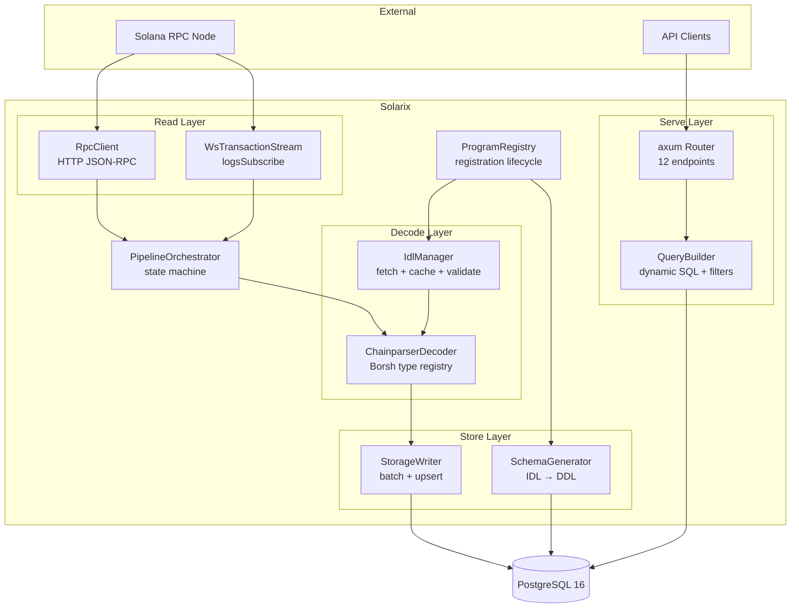

### Startup Sequence

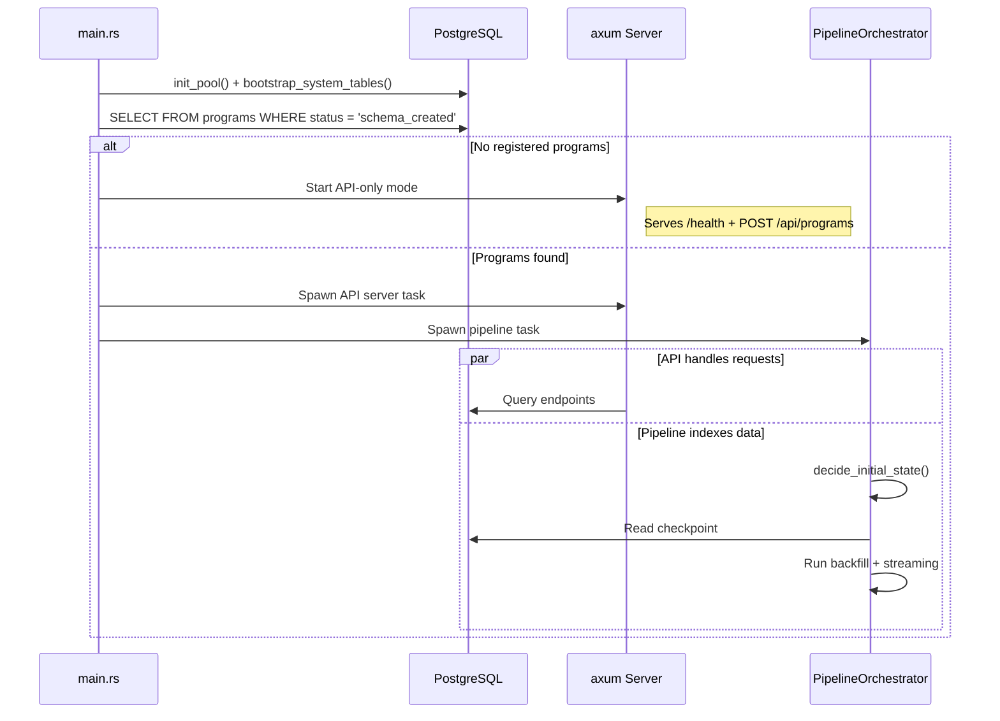

---

## Pipeline Architecture

### State Machine

The pipeline operates as a 5-state machine with well-defined transitions:

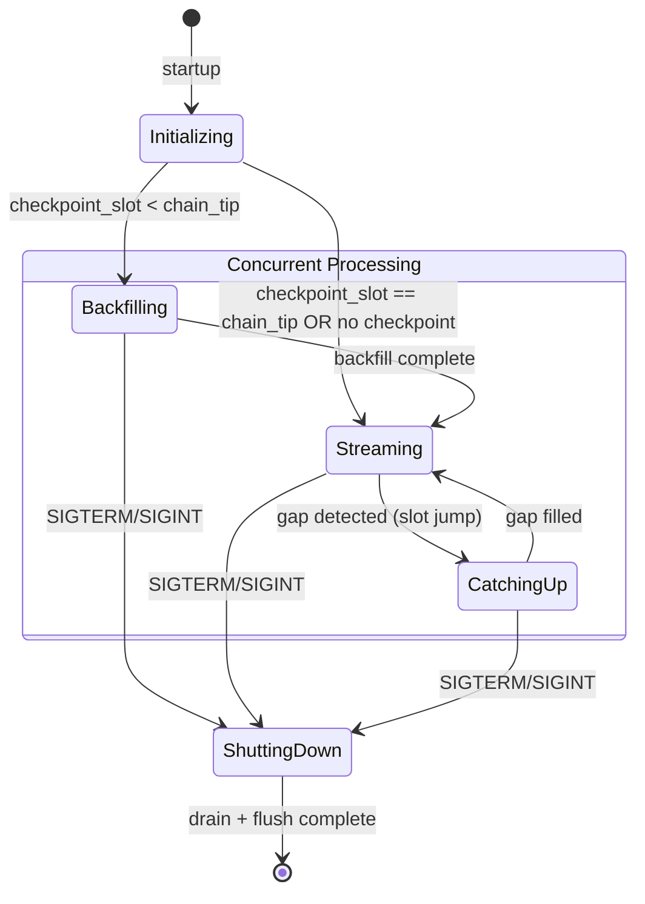

### Cold Start Decision

The `decide_initial_state()` function is a **pure function** (no I/O) that determines the initial pipeline state:

| Condition                               | Result                                  |
| --------------------------------------- | --------------------------------------- |
| No checkpoint + `start_slot` configured | Backfill from `start_slot` to chain tip |
| No checkpoint + no `start_slot`         | Stream from current tip                 |
| Checkpoint < chain tip                  | Backfill gap, then stream               |
| Checkpoint == chain tip                 | Stream immediately                      |
| Checkpoint > chain tip                  | Fatal error (wrong cluster?)            |

### Concurrent Backfill + Streaming (Option C)

During cold start, both the backfill and streaming paths run simultaneously:

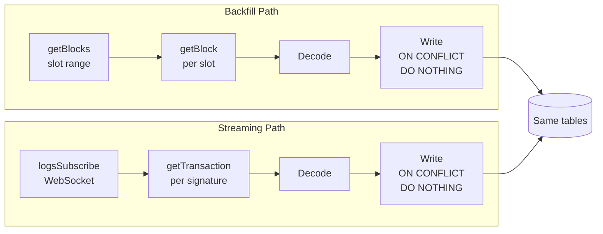

Both paths write to identical tables with `INSERT ... ON CONFLICT DO NOTHING`. Signature-based dedup ensures no duplicate data. If Solarix crashes and restarts, both paths resume from their respective checkpoints.

### Backfill Loop

```
for each chunk (50,000 slots):
    1. getBlocks(start, end)          # Get non-empty slot list
    2. for each slot in chunk:
        a. getBlock(slot)             # Full block with transactions
        b. Decode instructions        # Borsh → JSON via IDL
        c. Decode accounts            # getProgramAccounts
    3. Batch write (atomic tx)
    4. Update checkpoint
    5. Log progress (slots/sec, ETA)
```

### Gap Detection

While streaming, if the received slot jumps beyond `last_slot + 1`, the pipeline transitions to `CatchingUp`:

1. Spawns a mini-backfill for the missed slot range
2. Continues processing streaming transactions
3. Returns to `Streaming` once the gap is filled

---

## Data Architecture

### Schema-Per-Program Isolation

Each registered program gets its own PostgreSQL schema:

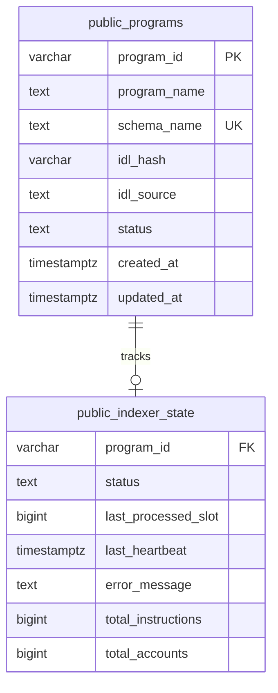

Program-specific schemas follow the naming pattern `{sanitized_name}_{first_8_program_id}` to prevent collisions:

```sql
-- Example: registering Jupiter v6
CREATE SCHEMA IF NOT EXISTS "jupiter_v6_jup6lkmu";

-- Account tables (one per IDL account type)
CREATE TABLE IF NOT EXISTS "jupiter_v6_jup6lkmu"."pool" (
    pubkey          TEXT PRIMARY KEY,
    slot_updated    BIGINT NOT NULL,
    write_version   BIGINT NOT NULL DEFAULT 0,
    lamports        BIGINT NOT NULL,
    data            JSONB NOT NULL,
    is_closed       BOOLEAN NOT NULL DEFAULT FALSE,
    updated_at      TIMESTAMPTZ NOT NULL DEFAULT NOW(),
    -- Promoted columns (simple scalars from IDL)
    token_a_mint    TEXT,
    token_b_mint    TEXT,
    fee_rate        INTEGER
);

-- GIN index for JSONB queries
CREATE INDEX IF NOT EXISTS idx_jupiter_v6_jup6lkmu_pool_data
    ON "jupiter_v6_jup6lkmu"."pool" USING GIN(data jsonb_path_ops);

-- Unified instructions table (append-only)
CREATE TABLE IF NOT EXISTS "jupiter_v6_jup6lkmu"."_instructions" (
    id                  BIGSERIAL PRIMARY KEY,
    signature           TEXT NOT NULL,
    slot                BIGINT NOT NULL,
    block_time          BIGINT,
    instruction_name    TEXT NOT NULL,
    instruction_index   SMALLINT NOT NULL,
    inner_index         SMALLINT,
    args                JSONB NOT NULL,
    accounts            JSONB NOT NULL,
    data                JSONB NOT NULL,
    is_inner_ix         BOOLEAN NOT NULL DEFAULT FALSE
);

-- Dedup index
CREATE UNIQUE INDEX IF NOT EXISTS idx_jupiter_v6_jup6lkmu__instructions_sig_ix
    ON "jupiter_v6_jup6lkmu"."_instructions"
    (signature, instruction_index, COALESCE(inner_index, -1));
```

### Promoted Column Strategy

The schema generator inspects each IDL field type and decides whether to promote it to a native PostgreSQL column:

| IDL Type           | PostgreSQL Type        | Promoted? |
| ------------------ | ---------------------- | --------- |
| `u8`, `u16`        | `SMALLINT` / `INTEGER` | Yes       |
| `u32`              | `INTEGER`              | Yes       |
| `u64`, `i64`       | `BIGINT`               | Yes       |
| `u128`, `i128`     | `NUMERIC(39,0)`        | Yes       |
| `u256`, `i256`     | `NUMERIC(78,0)`        | Yes       |
| `bool`             | `BOOLEAN`              | Yes       |
| `String`, `Pubkey` | `TEXT`                 | Yes       |
| `f32`              | `REAL`                 | Yes       |
| `f64`              | `DOUBLE PRECISION`     | Yes       |
| `Option<T>`        | Type of T (nullable)   | Yes       |
| `Vec<T>`           | JSONB only             | No        |
| `Struct`, `Enum`   | JSONB only             | No        |
| `Array<u8, N>`     | `BYTEA`                | Yes       |

**Every field** is always present in the JSONB `data` column. Promoted columns are extracted at write time for fast native-type queries.

### u64 Overflow Guard

Solana uses `u64` extensively, but PostgreSQL `BIGINT` is signed (max `i64::MAX`). For values exceeding `i64::MAX`:

- Promoted column receives `NULL`
- Full value is preserved as a string in the JSONB `data` column
- Queries on the promoted column miss these rows; JSONB queries still work

### Checkpoint System

Two-tier checkpoint tracking:

```
public.indexer_state        -- global pipeline state per program
  program_id, status, last_processed_slot, last_heartbeat

{schema}._checkpoints       -- per-stream slot cursors
  stream ("backfill" | "stream"), last_slot, last_signature
```

Checkpoints are updated atomically within the same transaction as block writes, ensuring crash-safe progress tracking.

---

## Module Boundaries

### Trait Seams

Four trait interfaces define the architectural boundaries. Each is mockable for unit testing:

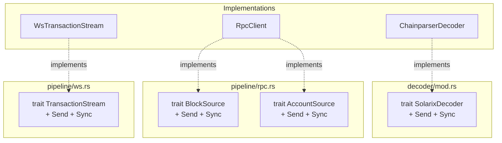

| Trait               | Methods                                             | Purpose                            |
| ------------------- | --------------------------------------------------- | ---------------------------------- |
| `SolarixDecoder`    | `decode_instruction()`, `decode_account()`          | Borsh bytes → typed JSON           |
| `BlockSource`       | `get_block()`, `get_slot()`                         | Block fetching abstraction         |
| `AccountSource`     | `get_program_accounts()`, `get_multiple_accounts()` | Account fetching abstraction       |
| `TransactionStream` | `connect()`                                         | WebSocket subscription abstraction |

### Dependency Graph

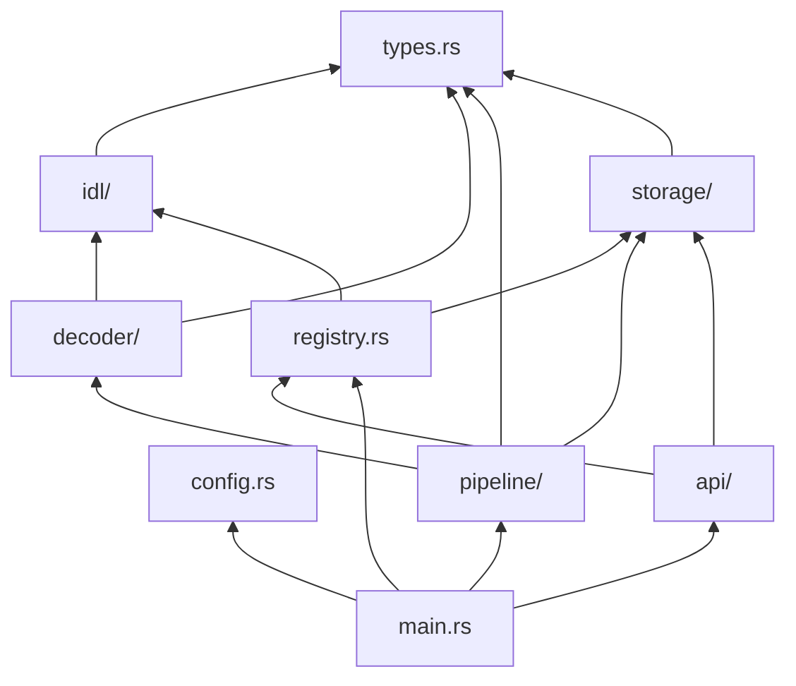

No circular dependencies. The `types` module sits at the bottom with shared data structures. Modules only depend downward.

---

## IDL Processing

### Fetch Cascade

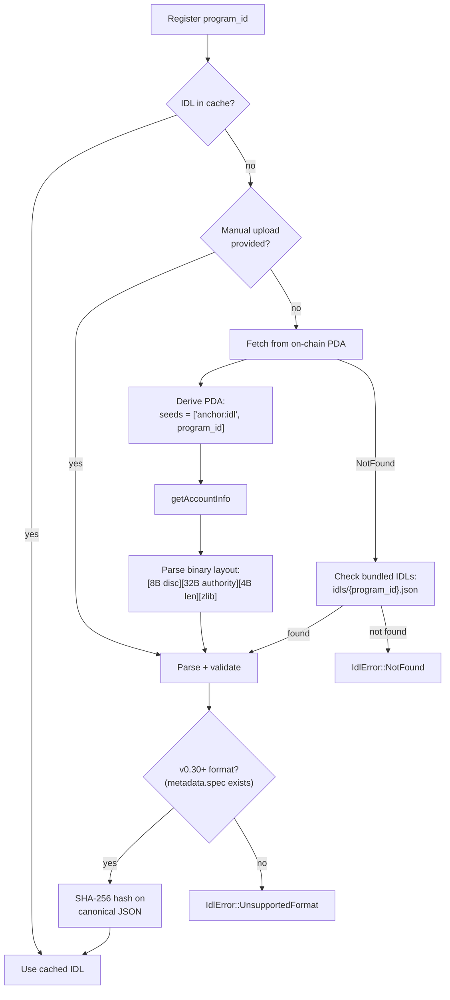

### IDL Account Binary Layout

```
Offset  Size    Field
0       8       Discriminator
8       32      Authority (pubkey)
40      4       Data length (LE u32)
44      N       zlib-compressed IDL JSON (max 16 MiB decompressed)
```

---

## Borsh Decoding

The `ChainparserDecoder` recursively walks IDL type definitions to decode Borsh-serialized bytes:

### Discriminator Matching

```
Instruction discriminator = SHA-256("global:{snake_case_name}")[0..8]
Account discriminator     = SHA-256("account:{PascalCase_name}")[0..8]
```

The decoder first reads 8 bytes from the data, matches against pre-computed discriminators from the IDL, then decodes the remaining bytes according to the matched type definition.

### Type System Coverage

18+ IDL types supported with recursive descent:

- **Primitives**: u8-u256, i8-i256, bool, f32, f64, String, Bytes, Pubkey
- **Collections**: `Vec<T>`, `Option<T>`, `Array<T, N>`
- **Compounds**: Structs (named/tuple fields), Enums (discriminator-tagged variants)
- **Solana-specific**: `COption<T>` (4-byte fixed-size tag, differs from Rust's 1-byte `Option`)
- **Generics**: Resolved through IDL type parameters

### Special Cases

| Case                          | Handling                                                         |
| ----------------------------- | ---------------------------------------------------------------- |
| `u128`/`i128`/`u256`/`i256`   | Serialized as JSON strings to prevent precision loss             |
| `f32`/`f64` NaN/Infinity      | Converted to strings (`"NaN"`, `"Infinity"`) for JSON compliance |
| `Pubkey`                      | Base58-encoded string                                            |
| `COption<T>`                  | 4-byte u32 tag: 0 = null, 1 = Some(T). Fixed-size inner.         |
| Unknown discriminator         | Logged at `warn!`, skipped (not fatal)                           |
| >90% decode failures in batch | Logged at `error!` (likely IDL mismatch)                         |

---

## Storage Layer

### Write Path

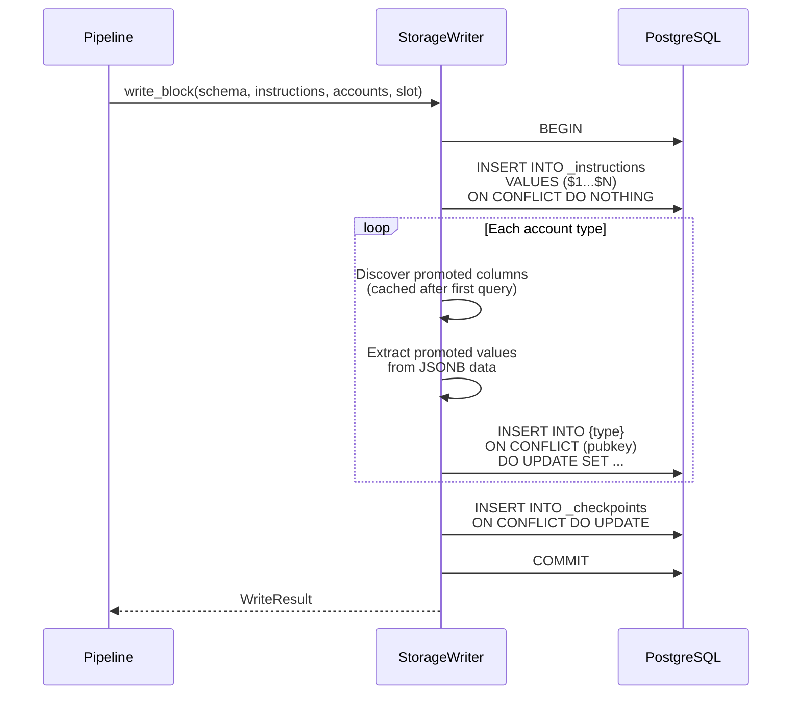

### Instruction Batch Insert

Instructions use `INSERT ... VALUES` with multiple rows in a single statement. The dedup unique index on `(signature, instruction_index, COALESCE(inner_index, -1))` handles duplicates from concurrent backfill + streaming.

### Account Upsert

Accounts use `INSERT ... ON CONFLICT (pubkey) DO UPDATE` to maintain latest state. Promoted columns are dynamically bound based on the table's actual schema, discovered via `information_schema.columns` on first write per table (then cached).

---

## API Layer

### Request Flow

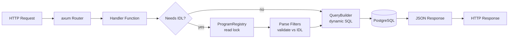

### Filter Resolution

Filters pass through a three-stage pipeline:

1. **Parse**: Tokenize `?filter=data.amount_gt=1000000` into `(column, operator, value)`
2. **Resolve**: Classify column as promoted (native SQL) or JSONB (path extraction), validate operator applicability
3. **Build SQL**: Generate parameterized WHERE clause

```sql
-- Promoted column (native type, indexed)
WHERE "balance" > $1

-- JSONB field (path extraction)
WHERE ("data"->>'nested_field')::BIGINT > $1

-- JSONB containment (for complex matches)
WHERE "data" @> $1::jsonb
```

### Pagination

- **Accounts**: Offset-based (`?limit=50&offset=100`)
- **Instructions**: Cursor-based (`?limit=50&cursor=<opaque>`) for stable ordering on append-only data

---

## Error Handling

### Error Enum Hierarchy

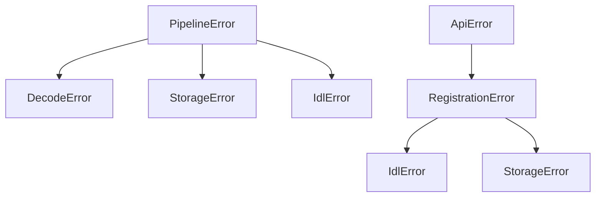

Five module-level error enums, each with classification:

| Enum            | Module            | Variants                                                                   | Classification                               |
| --------------- | ----------------- | -------------------------------------------------------------------------- | -------------------------------------------- |
| `IdlError`      | `idl/mod.rs`      | FetchFailed, ParseFailed, NotFound, UnsupportedFormat, DecompressionFailed | retryable (fetch), fatal (parse)             |
| `DecodeError`   | `decoder/mod.rs`  | UnknownDiscriminator, DeserializationFailed, IdlNotLoaded, UnsupportedType | skip-and-log                                 |
| `StorageError`  | `storage/mod.rs`  | ConnectionFailed, DdlFailed, WriteFailed, CheckpointFailed                 | retryable (connection), fatal (DDL)          |
| `PipelineError` | `pipeline/mod.rs` | RpcFailed, WebSocketDisconnect, RateLimited, Decode, Storage, Idl, Fatal   | `is_retryable()` method                      |
| `ApiError`      | `api/mod.rs`      | 11 variants                                                                | Maps to HTTP status codes via `IntoResponse` |

### Error Classification Strategy

```
retryable       → exponential backoff, retry up to timeout
                  Examples: 429 rate limit, network timeout, WS disconnect

skip-and-log    → warn! level, continue processing
                  Examples: unknown discriminator, decode failure on single tx

fatal           → error! level, halt pipeline
                  Examples: DB unreachable, invalid config, checkpoint > chain tip
```

Decode failures are tracked per-batch. If >90% of transactions in a chunk fail to decode, it escalates to `error!` level (probable IDL mismatch rather than individual data issues).

---

## Concurrency Model

### Shared State

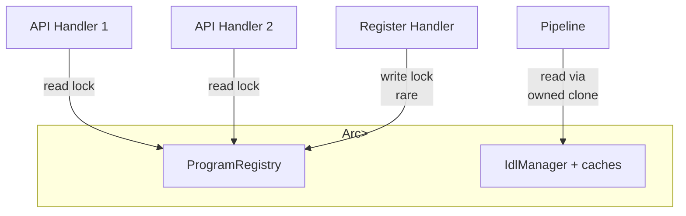

- **Read lock**: All query handlers, IDL lookups — concurrent, no contention
- **Write lock**: Program registration only — rare operation, acceptable blocking
- **Pipeline**: Receives owned IDL clone at startup, no lock contention during indexing

### Channel Architecture

```
RpcClient ──→ [mpsc(256)] ──→ Decoder ──→ [mpsc(256)] ──→ StorageWriter
                                                              ↓
WsStream  ──→ [mpsc(256)] ──→ Decoder ──→ [mpsc(256)] ──→ StorageWriter
                                                              ↓
                                                         PostgreSQL
```

Bounded `tokio::sync::mpsc` channels (capacity 256) provide backpressure between stages. If the writer falls behind, senders block, naturally throttling the reader.

### Shutdown Protocol

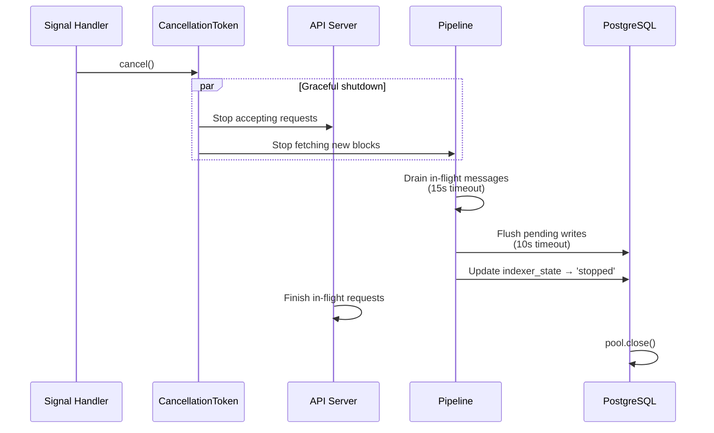

The `CancellationToken` from `tokio-util` propagates shutdown across all tasks. Configurable timeouts prevent hung shutdown.

---

## Reliability Features

### Rate Limiting

`governor` crate with GCRA (Generic Cell Rate Algorithm):

- Default: 10 requests/second (matches public RPC limits)
- Async-native — waits for permit without busy-spinning
- Applied to all outbound RPC calls

### Retry with Backoff

`backon` crate with exponential backoff:

- Initial delay: 500ms
- Maximum delay: 30s
- Total timeout: 5 minutes
- Jitter: built-in randomization
- Only retries classified-retryable errors (429, timeouts, network errors)

### WebSocket Reliability

- **Heartbeat**: Ping every 30s, pong timeout 10s
- **Auto-reconnect**: On disconnect, reconnect with fresh subscription
- **Dedup cache**: LRU cache of 10,000 recent signatures prevents reprocessing on reconnect
- **Gap detection**: Slot jumps trigger mini-backfill to fill missed data

### Data Integrity

- All block writes are atomic (single PostgreSQL transaction)
- Checkpoint updated within the same transaction as data writes
- `INSERT ON CONFLICT DO NOTHING` makes all writes idempotent
- Account upserts use `ON CONFLICT (pubkey) DO UPDATE` for latest-state semantics
- DDL uses `IF NOT EXISTS` everywhere — self-bootstrapping, no migration tool needed

### Graceful Shutdown

1. **Signal catch**: SIGTERM/SIGINT via `tokio::signal`
2. **Drain**: Process in-flight channel messages (configurable timeout)
3. **Flush**: Final DB writes with timeout
4. **Status update**: Set `indexer_state.status = 'stopped'`
5. **Pool close**: Clean connection teardown
